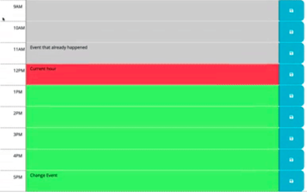

# Work Day Scheduler
A simple calendar application that allows a user to save events for each hour of the day. This app will run in the browser and feature dynamically updated HTML and CSS powered by jQuery.

## Technologies
* HTML
* CSS
* jQuery
* Moment.js

## Screenshot

    </img>

## GitHub Repo
https://github.com/minhhap/work-day-scheduler